# Respuestas Tarea 4 del curso IE0405
Estudiante: Mauricio Céspedes Tenorio - B71986

1. Crear un esquema de modulación BPSK para los bits presentados. Esto implica asignar una forma de onda sinusoidal normalizada (amplitud unitaria) para cada bit y luego una concatenación de todas estas formas de onda.  
R\ En la modulación **BPSK** (siglas del inglés *Binary Phase Shift Keying*, en español *Modulación por desplazamiento de fase*) se envía una forma de onda sinusoidal para el bit 1 y una sinusoidal negada (-seno) para el bit 0.  
Para conseguir esto, primero se extrajeron los datos de bits proporcionados en el archivo *bits10k.csv* con ayuda de la función *genfromtxt('bits10k.csv', delimiter='\n')*, indicando que el delimitador es una nueva línea. Posteriomente, se contaron la cantidad de datos ("bits") que se dieron en el archivo.  
Para la modulación, se empezó por definir la frecuencia de 5 kHz de la onda portadora y su periodo de símbolo (igual a un periodo completo que es 1/T). Asimismo, se consideró que 80 puntos de muestreo para cada periodo (equivalente a cada bit) era suficiente. Con esto  definido, se creó la onda portadora sinusoidal, la sinusoidal negada no se creó al sólo ser la señal seno multiplicacada por -1. Dicha portadora se muestra a continuación:  

  
   
  Figura 1. Señal sinusoidal que funcionará como onda portadora.

  
A continuación, se detalló que la frecuencia de muestreo es de 80 puntos por periodo (que es equivalente a 400 kHz). Para la creación de la señal BPSK, se creó el vector temporal total <em>t</em>, que equivalente al periodo de la portadora multiplicacado por la cantidad de bits. Luego se creó un array del tamaño necesario y, mediante un <em>for</em>, se colocó una onda sinusoidal en donde existiera un 1 y una sinusoidal negada en donde hubiera un 0. Para ello, se recorrió la variable <em>senal</em> para la onda modulada de 50 en 50 puntos y se utilizó el código <em>(2b-1)</em> para cambiar los 0 en los bits por un -1; de esta forma, cuando hubiera un 0, se inserta un -seno en la onda modulada, y un seno en caso de encontrar un 1.  
La onda modulada en BPSK para los primeros 8 bits se muestra en la siguiente Figura. En el archivo CSV se puede observar que dichos bits son: 0, 1, 0, 1, 0, 1, 1, 0; lo cual se corresponde con lo observado en la Figura, interprendo así que la modulación es correcta.  

  
   
  Figura 2. Señal modulada en BPSK para los primeros 8 bits.

  

2. Calcular la potencia promedio de la señal modulada generada.  
Para calcular la potencia promedio, se utilizó la siguiente ecuación:  

    

  
Donde el término adentro de la integral es la potencia instantánea de la señal. Por ello, se calculó el cuadrado de la onda modulada <em>senal</em> y luego se creó una variable <em>Pprom</em>,la potencia promedio, que es igual a la integral de la instantánea (conseguida con el comando <em>integrate.trapz(Pinst, t)</em>) dividida entre el tiempo total de la señal modelada, que sería <em>N*T</em>. Esto representa una ligera variación con respecto a la ecuación presentada; sin embargo, se hace así al no ser una señal periódica. Finalmente, el valor obtenido para la potencia promedio fue de 0.4938. Se notó que según los puntos de muestreo <em>p</em>, el resultado variaba ligeramente.  

3. Simular un canal ruidoso del tipo AWGN (ruido aditivo blanco gaussiano) con una relación señal a ruido (SNR) desde -2 hasta 3 dB.  
Para comenzar este punto 3, se crearon dos variables tipo <em>array</em>: <em>valores_SNR</em> con los valores de SNR a evaluar (-2, 1, 0, 1, 2 y 3) y <em>valores_BER</em> es una variable vacía para guardar la tasa de error de bits para cada SNR, que se necesita para el punto 5 y 6. Es importante mencionar que primero se realizó el código para un único SNR y cuando ya funcionó, se indentó dentro de un <em>for</em> para ir probando los distintos valores de SNR. Ahora, como el punto 4 pedía graficar la densidad espectral de potencia de la señal antes y después del canal ruidoso, se notó que la gráfica antes del canal iba a ser única, en cambio la de después varía según el SNR (es decir, va a dentro del <em>for</em> ya mencionado). Por ello, se procedió a realizar la primera de estas gráficas antes de seguir con el punto 3. A pesar de que se hizo de esta forma en el código por facilidad de programación, en esta documentación se explicará en el orden establecido por el profesor en el enunciado.  
Como ya se mencionó, para poder realizar el punto 3 (también parte del 4, el 5 y el 6) se realizó un <em>for</em> para probar los diferentes valores de SNR. Ahora, adentro de esta función cíclica, primeramente se calculó la potencia deseada del canal ruidoso con la ecuación:

    

  
Esto se hace debido a que el canal ruidoso se simula como una distribución normal centrada en cero y con una desviación estándar definida por el SNR. En línea de poder encontrar este <em>ruido</em>, se calculó la desviación estándar como la raíz de la potencia deseada del canal ruidoso, se creó el canal ruidoso como: <em>ruido = np.random.normal(0, sigma, senal.shape)</em> y se le sumó a la señal modulada que se tenía para crear la señal ruidosa <em>Rx</em>. Como última parte del punto 3, se graficó dicha señal ruidosa para los primeros 8 bits para cada SNR.  

  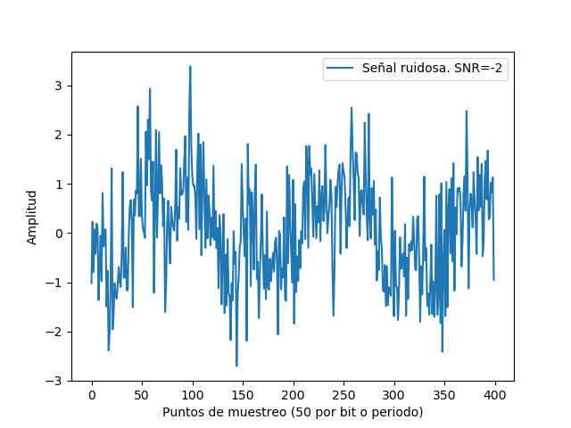
   
  Figura 3. Señal ruidosa para un SNR de -2 dB.

  

  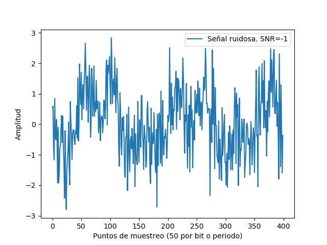
   
  Figura 4. Señal ruidosa para un SNR de -1 dB.

  

  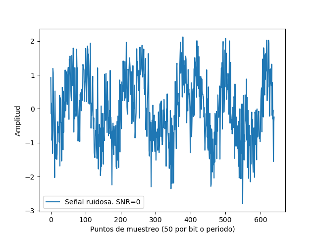
   
  Figura 5. Señal ruidosa para un SNR de 0 dB.

  

  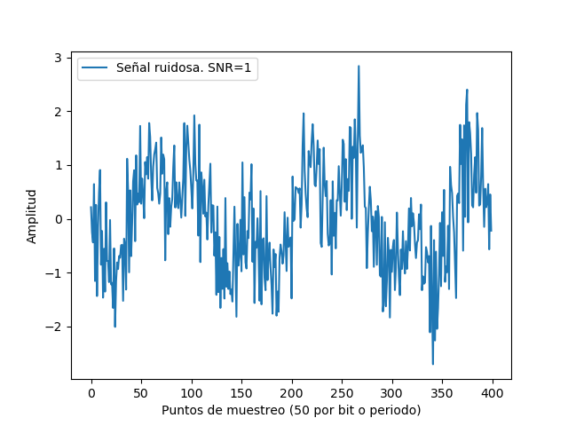
   
  Figura 6. Señal ruidosa para un SNR de 1 dB.

  

  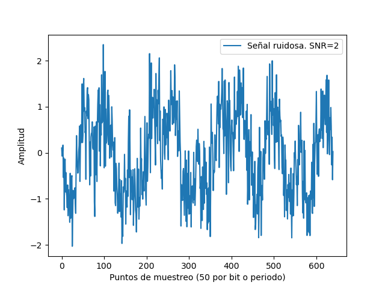
   
  Figura 7. Señal ruidosa para un SNR de 2 dB.

  

  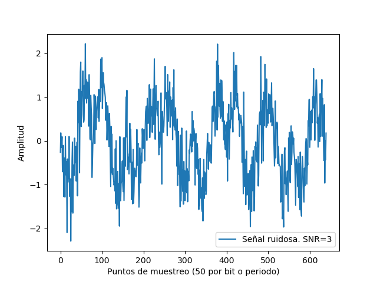
   
  Figura 8. Señal ruidosa para un SNR de 3 dB.

  

4. Graficar la densidad espectral de potencia de la señal con el método de Welch (SciPy), antes y después del canal ruidoso.  
Como ya fue explicado, la gráfica de la densidad espectral de potencia antes del canal ruidoso se realizó antes de crear el <em>for</em> del punto anterior. Para ello, se utilizaron dos funciones particulares del método Welch de SciPy. La primera fue: <em>fw, PSD = signal.welch(senal, fm, nperseg=1024)</em>; y la segunda: <em>plt.semilogy(fw, PSD)</em>. El resultado obtenido se muestra a continuación:  

  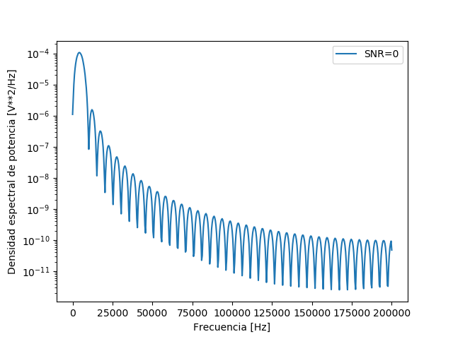
   
  Figura 9. Densidad espectral de potencia de la señal antes del canal ruidoso.

  
Dentro del <em>for</em>, se graficó de manera prácticamente idéntica la densidad espectral de la señal pero después del canal ruidoso. Para ello, en las funciones del método Welch se cambió <em>senal</em> por <em>Rx</em>. Los resultados para cada SNR se muestran a continuación:

  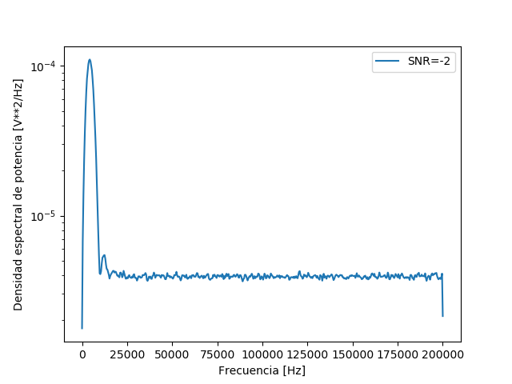
   
  Figura 10. Densidad espectral de potencia de la señal después del canal ruidoso. SNR=-2 dB.

  

  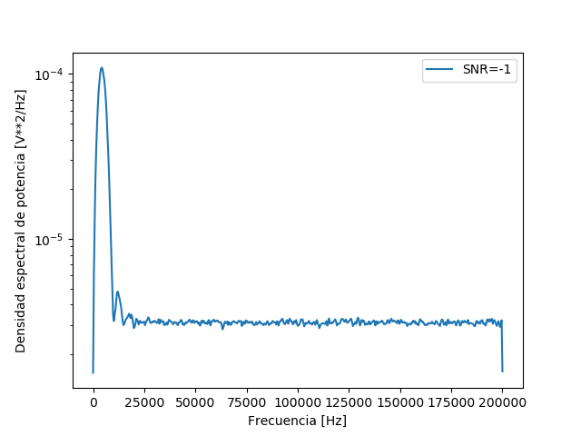
   
  Figura 11. Densidad espectral de potencia de la señal después del canal ruidoso. SNR=-1 dB.

  

  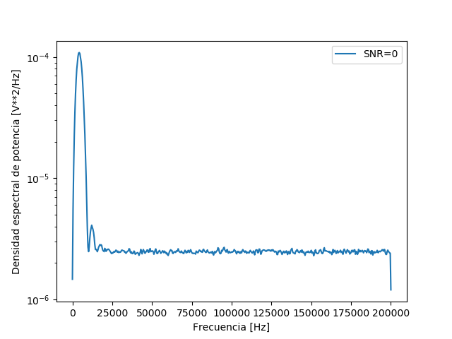
   
  Figura 12. Densidad espectral de potencia de la señal después del canal ruidoso. SNR=0 dB.

  

  
   
  Figura 13. Densidad espectral de potencia de la señal después del canal ruidoso. SNR=1 dB.

  

  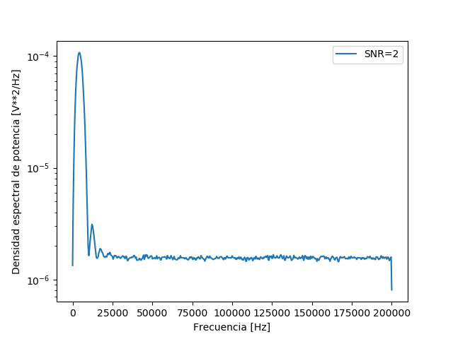
   
  Figura 14. Densidad espectral de potencia de la señal después del canal ruidoso. SNR=2 dB.

  

  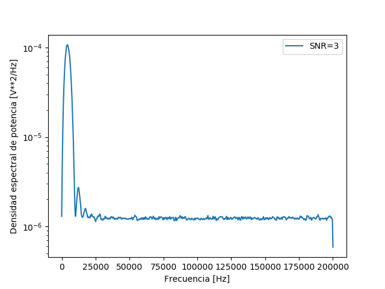
   
  Figura 15. Densidad espectral de potencia de la señal después del canal ruidoso. SNR=3 dB.

  
