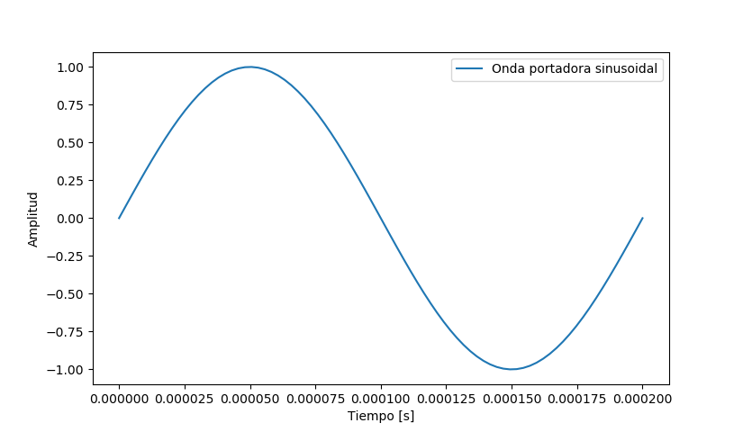
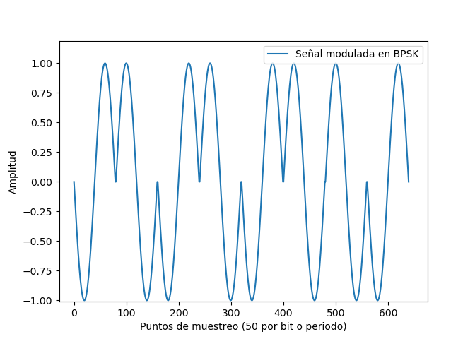

# Respuestas Tarea 4 del curso IE0405
Estudiante: Mauricio Céspedes Tenorio - B71986

1. Crear un esquema de modulación BPSK para los bits presentados. Esto implica asignar una forma de onda sinusoidal normalizada (amplitud unitaria) para cada bit y luego una concatenación de todas estas formas de onda.  
R\ En la modulación **BPSK** (siglas del inglés *Binary Phase Shift Keying*, en español *Modulación por desplazamiento de fase*) se envía una forma de onda sinusoidal para el bit 1 y una sinusoidal negada (-seno) para el bit 0.  
Para conseguir esto, primero se extrajeron los datos de bits proporcionados en el archivo *bits10k.csv* con ayuda de la función *genfromtxt('bits10k.csv', delimiter='\n')*, indicando que el delimitador es una nueva línea. Posteriomente, se contaron la cantidad de datos ("bits") que se dieron en el archivo.  
Para la modulación, se empezó por definir la frecuencia de 5 kHz de la onda portadora y su periodo de símbolo (igual a un periodo completo que es 1/T). Asimismo, se consideró que 80 puntos de muestreo para cada periodo (equivalente a cada bit) era suficiente. Con esto  definido, se creó la onda portadora sinusoidal, la sinusoidal negada no se creó al sólo ser la señal seno multiplicacada por -1. Dicha portadora se muestra a continuación:  

  
   
  Figura 1. Señal sinusoidal que funcionará como onda portadora.

  
A continuación, se detalló que la frecuencia de muestreo es de 80 puntos por periodo (que es equivalente a 400 kHz). Para la creación de la señal BPSK, se creó el vector temporal total <em>t</em>, que equivalente al periodo de la portadora multiplicacado por la cantidad de bits. Luego se creó un array del tamaño necesario y, mediante un <em>for</em>, se colocó una onda sinusoidal en donde existiera un 1 y una sinusoidal negada en donde hubiera un 0. Para ello, se recorrió la variable <em>senal</em> para la onda modulada de 50 en 50 puntos y se utilizó el código <em>(2b-1)</em> para cambiar los 0 en los bits por un -1; de esta forma, cuando hubiera un 0, se inserta un -seno en la onda modulada, y un seno en caso de encontrar un 1.  
La onda modulada en BPSK para los primeros 8 bits se muestra en la siguiente Figura. En el archivo CSV se puede observar que dichos bits son: 0, 1, 0, 1, 0, 1, 1, 0; lo cual se corresponde con lo observado en la Figura, interprendo así que la modulación es correcta.  

  
   
  Figura 2. Señal modulada en BPSK para los primeros 8 bits.

  

2. Calcular la potencia promedio de la señal modulada generada.  
Para calcular la potencia promedio, se utilizó la siguiente ecuación:  

    

  
Donde el término adentro de la integral es la potencia instantánea de la señal.
